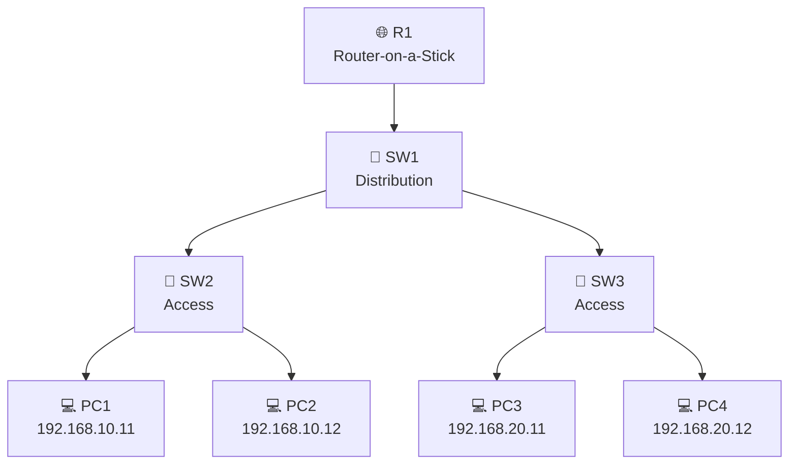

# 🌐 Cisco VLAN Troubleshooting Lab


A hands-on Cisco Packet Tracer lab focused on **VLANs, inter-VLAN routing, 802.1Q trunking, and network troubleshooting**.

## 🗺️ Network Topology



### 🟢 VLAN 10 — Finance
`PC1` • `PC2` • Gateway `192.168.10.1`

### 🔵 VLAN 20 — Engineering
`PC3` • `PC4` • Gateway `192.168.20.1`

---

## 🔧 Troubleshooting Challenge

**Symptom:** One Finance workstation suddenly loses connectivity while other users remain online.

<details>
<summary><b>🔍 View Diagnosis</b></summary>

The affected switch port was assigned to the wrong VLAN.

```text
SW2 Fa0/5 → VLAN 1 ❌
SW2 Fa0/5 → VLAN 10 ✅
```

Commands used:

```bash
show interfaces status
show vlan brief
show interfaces trunk
ping
```

</details>

<details>
<summary><b>🛠️ View Fix</b></summary>

```cisco
configure terminal
interface fa0/5
switchport access vlan 10
end
```

Connectivity was verified with:

```text
PC1 → Gateway     ✅
PC1 → PC2         ✅
PC1 → VLAN 20     ✅
```

</details>

---

## 📂 Packet Tracer Files

| File | Description |
|---|---|
| `01-baseline.pkt` | ✅ Fully operational network |
| `01-broken.pkt` | ❌ VLAN misconfiguration |
| `01-resolved.pkt` | 🔧 Troubleshot and restored |

> 💡 Download the `.pkt` files and open them with Cisco Packet Tracer to explore the network yourself.

---

### 🧠 Skills Demonstrated

`Cisco IOS` • `VLANs` • `802.1Q` • `Router-on-a-Stick` • `Inter-VLAN Routing` • `Layer 2 Troubleshooting`
